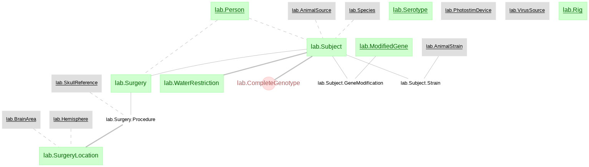
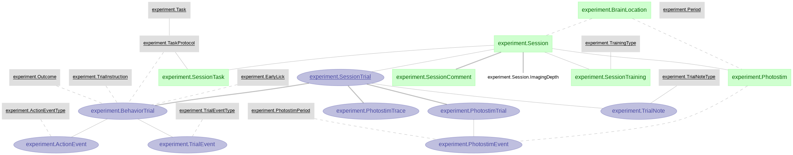
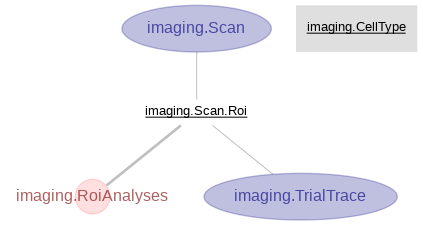

# Chen-2017

This repository sets up the data pipeline corresponding to the data in Chen et al., (2017). **"A Map of Anticipatory Activity in Mouse Motor Cortex."** and provides the notebook for the figure replication.

Publication link: http://dx.doi.org/10.1016/j.neuron.2017.05.005

Access to view the notebook: https://nbviewer.jupyter.org/github/shenshan/Chen-2017/blob/master/notebooks/Figure_replication.ipynb

This study characterized selectivity of cells in anterior lateral motor cortex (ALM) and medial motor cortex (MM). Cells are classified into 5 types: lick direction cells (lick), object location cells (lick), outcome cells (outcome), complex selective cells that are selective to multiple features, and non selective cells. The notebook in this repository replicates Figure 4, 5 and part of Figure 6 of the paper.

## Schema structure

The `lab` schema:

The `experiment` schema:

The `imaging` schema:

